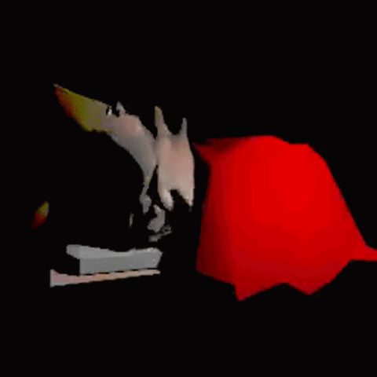
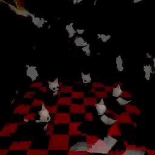

<!--Hey there! Then name's Jacob. I'm an adolescent CS student based in southern Poland. My current main project is [my site](https://shatterwares.com) 

 a

My interests: 
- 📗 Reading books (as long as they are not school books)
- 🔬 Computers (more precisely computer science, AIs)
- 🧙 Philosophy
- 💻 C++, HTML, JS, Python, and more in foreseeable future
- 🔌 Benchmarking, sandboxing, component testing
- ✨ Logo designing
- 🚲 Cycling
- 🧑‍🤝‍🧑 Meeting with friends
- 🦠 Computer and biological malware
- 🌼 Botanics and biology
- ☕ English

Most of my stuff is for school and some is prohibited from the public view. Feel free to contact me at Discord: "jakubekgranie".
All the code owned and/or co-owned by me is copyrighted, and you need my and my acquaintance(s)'s approval before using it in any way different than educational.
I've never been affiliated with any comglomerate and/or company, all information sources telling so are fake.-->
<h1 align="center">✧ // Hello world! I'm jakubekgranie!_</h1>
 

  

 

My real name's Jacob (shocker). I am an <b>adolescent Polish CS student</b> with <b>plans of attaining webmastery and desktop app creation proficiency.</b> Except for the obvious interests, I enjoy <i>philosophy</i> - especially <i>nihilism</i>, <i>objectivism</i> and <i>ontology</i>, <i>botany</i>, <i>humanism</i>, <i>reading</i>, <i>pathology</i> and <i>self-development</i>. I also harbor thoughts about emigrating, albeit for the time being such plans are unexecutable.
 
 

 
I used to use/also am using names such as <b>starstruck</b> and <b>sh0s</b>.

<h3 align="center">car lair</h4>

&nbsp;&nbsp; &nbsp;&nbsp;

<h2 align="center">✧ >> What's new and what's not!</h2>
I am currently <b>working on my very own webisite - <a href="https://shatterwares.com">shatterwares.com</a>.</b> It's a hobby project I've been cultivating since ~last February. The work enables me to learn many new things and explore horizons I would've never in the natural environment of mine (school). Future <b>plans associated include adding a project hub, a pastebin-ish utility (least priority due to server-side language limitations)</b>, and maybe a blog if I'll care enough. I <b>love critique</b>, so if you want to lmk what should be this and that, <b>hmu on Discord!</b>
 
 

<h2 align="center">✧ >> Projects</h2>
Links to featured projects will appear here <b>once <a href="https://https://github.com/jakubekgranie/shatterwares.com">ShatterWares'</a> core development reaches completion.</b> Then expect to find them there!
  
<h2 align="center">✧ >> Curios of moderate importance</h2>
<ul>
  <li>I've <b><i>never</i> been affiliated</b> with any conglomerate, corporation, team, etc. All sources claiming so are not to be trusted with.</li>
  <li><b>I don't own any social media except Discord</b> since 2022.</li>
  <li>I own and moderate only <b>one domain - shatterwares.com</b>.</li>
</ul>
 
<i>cya on the interwebs!!!! ~ Jacob</i>
